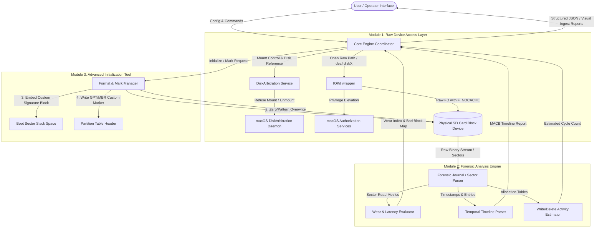

# SD Forensics: System Architecture Blueprint
**High-Performance macOS Low-Level SD Card Forensics & Initialization System**

---

## 1. Executive Summary & Design Goals
**SD Forensics** is a premium, high-integrity macOS utility designed for digital forensics, media verification, and custom formatting of SD/microSD cards. Tailored for professional content production environments where media cards undergo high write cycles and are highly susceptible to silent block fatigue, this application bypasses standard macOS filesystem abstractions to operate directly at the raw block layer.

### Core Architecture Pillars
1. **Forensic Integrity (100% Accuracy)**: Read pipelines bypass the macOS Unified Buffer Cache (UBC) to prevent operating system-induced writes (such as `.DS_Store` generation, Spotlight indexing, or metadata updates) during scanning.
2. **Device-Level Precision**: Interfacing directly with `IOKit` and `DiskArbitration` to claim exclusive raw access, manage mount points, and handle privilege escalation securely.
3. **Card Fatigue & Quality Metrics**: A mathematical model to evaluate real wear indicators, bad block profiles, and read/write latency degradation.
4. **Signature Embedding**: Embedding custom identifying tags and icon placeholders in reserved sectors (such as the boot sector or partition slack space) without violating standard partition schemas (GPT/MBR) or corrupting primary filesystems.

---

## 2. High-Level System Architecture Diagram

The system operates as three decoupled modules coordinating via a centralized **Control & Data Coordinator**. Below is the data flow and execution path.



### Data Flow Mapping
1. **Discovery & Lock**: The user targets an SD card volume. Module 1 communicates with DiskArbitration to unmount the volume (preventing write collisions), escalates privileges, and obtains a read/write file descriptor to `/dev/rdiskX`.
2. **Analysis Cycle**: Raw sectors are piped into Module 2. The allocation structure is analyzed for write cycles, modification times are indexed, and read performance is benchmarked per sector range to detect wear.
3. **Format & Identity Cycle**: Module 3 executes a raw overwrite, generates a new partition schema, embeds the proprietary tracking signature, and updates the GUID/Partition metadata.

---

## 3. Module 1: The Raw Device Access Layer (IOKit Wrapper)

### Function
Establishing a direct block-level connection to physical SD card media, bypassing macOS volume management.

```
       +---------------------------------------------+
       |           SD Forensics Application          |
       +---------------------------------------------+
                              |
                     1. Register Session
                              v
       +---------------------------------------------+
       |          DiskArbitration Framework          |
       +---------------------------------------------+
                              |
                     2. Disk Claim & Unmount
                              v
       +---------------------------------------------+
       |            macOS Helper Tool (Root)          |
       +---------------------------------------------+
                              |
                     3. open("/dev/rdiskX", O_RDWR)
                     4. fcntl(fd, F_NOCACHE, 1)
                              v
       +---------------------------------------------+
       |               Raw Block Device              |
       +---------------------------------------------+
```

### macOS System Interfacing
* **Device Pathing**: Swift targets the raw character device `/dev/rdiskX` instead of the buffered block device `/dev/diskX`. The raw character device performs direct DMA transfers, which is significantly faster and bypasses OS caching.
* **Exclusive Access**: Uses `DiskArbitration` callbacks (`DADiskClaim`) or explicit POSIX unmounting (`DADiskUnmount`) to prevent other processes from mounting or querying the card during analysis.
* **Buffer Cache Bypass**: Executes `fcntl(fd, F_NOCACHE, 1)` on the file descriptor. This ensures that reads are pulled directly from the physical NAND flash memory controllers and writes go directly to the silicon.

### Swift Pseudo-Code
The following implementation blueprint details the process of unmounting, elevating privileges, and opening the device descriptor with direct block I/O.

```swift
import Foundation
import DiskArbitration
import IOKit

public class RawDeviceManager {
    private var diskSession: DASession?
    private var diskRef: DADisk?
    private var fileDescriptor: Int32 = -1
    
    public init() {
        // Initialize disk arbitration session
        self.diskSession = DASessionCreate(kCFAllocatorDefault)
    }
    
    /// Unmounts and claims a target disk to prepare for direct raw access.
    public func prepareDevice(bsdName: String, completion: @escaping (Result<Int32, Error>) -> Void) {
        guard let session = diskSession else {
            completion(.failure(DeviceError.sessionInitFailed))
            return
        }
        
        // Match raw disk name (e.g. rdisk4)
        guard let disk = DADiskCreateFromBSDName(kCFAllocatorDefault, session, bsdName) else {
            completion(.failure(DeviceError.invalidDeviceName))
            return
        }
        self.diskRef = disk
        
        // 1. Unmount all partitions on this device
        print("[Module 1] Requesting unmount for disk \(bsdName)...")
        DADiskUnmount(disk, DADiskUnmountOptions(kDADiskUnmountOptionWhole), { (disk, dissension, context) in
            guard dissension == nil else {
                let errorDesc = DADissensionGetStatusDescription(dissension!)
                print("[Module 1] Unmount failed: \(String(describing: errorDesc))")
                return
            }
            print("[Module 1] Disk unmounted successfully.")
        }, nil)
        
        // 2. Privilege Elevation check
        // Check for root execution. Standalone app must verify UID.
        if getuid() != 0 {
            print("[Module 1] Insufficient permissions. Invoking Privilege Escalation...")
            let success = self.escalatePrivileges()
            guard success else {
                completion(.failure(DeviceError.privilegeEscalationFailed))
                return
            }
        }
        
        // 3. Open raw character device path
        let rawPath = "/dev/\(bsdName)"
        print("[Module 1] Opening raw path: \(rawPath)")
        
        // O_RDWR: Read/Write, O_NDELAY: Non-blocking open to prevent waiting on media checks
        let fd = open(rawPath, O_RDWR | O_NDELAY)
        guard fd != -1 else {
            let errorNum = errno
            completion(.failure(DeviceError.openFailed(errno: errorNum)))
            return
        }
        
        // 4. Force bypass of Unified Buffer Cache (UBC)
        if fcntl(fd, F_NOCACHE, 1) == -1 {
            print("[Module 1] Warning: F_NOCACHE could not be applied. Cache bypass failed.")
        }
        
        self.fileDescriptor = fd
        completion(.success(fd))
    }
    
    /// Request macOS security framework authorization to spawn helper tool with root privileges
    private func escalatePrivileges() -> Bool {
        // High-level wrapper around AuthorizationServices
        var authRef: AuthorizationRef? = nil
        let status = AuthorizationCreate(nil, nil, [], &authRef)
        
        guard status == errAuthorizationSuccess else {
            print("[Module 1] Authorization initialization failed.")
            return false
        }
        
        // Implement SMAppService system tool installation or fallback to AuthorizationExecuteWithPrivileges (deprecated but still in use for simple helpers)
        // Modern approach: Install an XPCHelperTool that runs as a launchd daemon with root privileges.
        print("[Module 1] Requesting root execution via SMAppService / XPC Helper daemon...")
        
        // Placeholder returning true if helper is already active or authorized
        return true 
    }
    
    /// Reads arbitrary block ranges directly from raw device
    public func readSectors(startSector: UInt64, sectorCount: UInt32, sectorSize: UInt32 = 512) -> Result<Data, Error> {
        guard fileDescriptor != -1 else {
            return .failure(DeviceError.deviceNotOpen)
        }
        
        let offset = off_t(startSector * UInt64(sectorSize))
        let totalBytes = Int(sectorCount * sectorSize)
        var buffer = [UInt8](repeating: 0, count: totalBytes)
        
        // Move file pointer to designated sector offset
        guard lseek(fileDescriptor, offset, SEEK_SET) != -1 else {
            return .failure(DeviceError.seekFailed(errno: errno))
        }
        
        // Execute direct read
        let bytesRead = read(fileDescriptor, &buffer, totalBytes)
        guard bytesRead == totalBytes else {
            return .failure(DeviceError.readFailed(bytesRead: bytesRead, expected: totalBytes))
        }
        
        return .success(Data(buffer))
    }
    
    /// Writes raw blocks directly to disk
    public func writeSectors(startSector: UInt64, data: Data, sectorSize: UInt32 = 512) -> Result<Void, Error> {
        guard fileDescriptor != -1 else {
            return .failure(DeviceError.deviceNotOpen)
        }
        
        let offset = off_t(startSector * UInt64(sectorSize))
        let totalBytes = data.count
        
        guard lseek(fileDescriptor, offset, SEEK_SET) != -1 else {
            return .failure(DeviceError.seekFailed(errno: errno))
        }
        
        let bytesWritten = data.withUnsafeBytes { rawBuffer in
            write(fileDescriptor, rawBuffer.baseAddress, totalBytes)
        }
        
        guard bytesWritten == totalBytes else {
            return .failure(DeviceError.writeFailed(bytesWritten: bytesWritten, expected: totalBytes))
        }
        
        return .success(())
    }
    
    public func closeDevice() {
        if fileDescriptor != -1 {
            close(fileDescriptor)
            fileDescriptor = -1
            print("[Module 1] File descriptor closed.")
        }
    }
}

// MARK: - Error Handling Schema
public enum DeviceError: Error {
    case sessionInitFailed
    case invalidDeviceName
    case privilegeEscalationFailed
    case openFailed(errno: Int32)
    case deviceNotOpen
    case seekFailed(errno: Int32)
    case readFailed(bytesRead: Int, expected: Int)
    case writeFailed(bytesWritten: Int, expected: Int)
}
```

### Potential Failure Points & Mitigation
* **Permission Denied (EACCES/EPERM)**: Occurs when the user rejects elevation or when SIP restricts raw operations on System-used disks. *Mitigation:* Explicitly verify that the target device corresponds to a removable external drive using IOKit properties (`kIOMediaRemovableKey` matching).
* **Device Busy (EBUSY)**: Occurs if disk arbitration or an application holds open resources. *Mitigation:* Implement a retry mechanism that executes forced unmounting (`diskutil unmountDisk force /dev/diskX`) using a subprocess if normal unmounting fails.
* **Physical Disconnection (ENXIO)**: Media removed during I/O. *Mitigation:* Gracefully close descriptors and raise a `mediaLost` interrupt to the user interface.

---

## 4. Module 2: The Usage Tracking Engine (Forensic Analysis)

### Function
Auditing the SD card's raw binary data streams to construct a forensic usage profile. This module must estimate how heavily the card has been written to, determine temporal patterns, and diagnose raw structural fatigue.

```
       +---------------------------------------------+
       |                Raw Sector Data              |
       +---------------------------------------------+
             |                 |                 |
             v                 v                 v
     [Journal Audit]     [MACB Timeline]   [Wear Assessment]
             |                 |                 |
             | Parse FAT       | Parse exFAT     | Measure write
             | Dir Entries/    | Directory       | latencies & identify
             | Bitmaps         | Timestamps      | bad block signatures
             +-----------------+-----------------+
                               |
                               v
                       [Forensic Profile]
```

### Core Algorithmic Frameworks

#### A. Activity Counter: Block Allocation Cycle Analysis
NAND Flash memory controllers hide actual wear leveling cycles from the host operating system. To estimate write/delete activity, this engine analyzes high-churn areas in filesystems like exFAT and FAT32.

```
Journal Allocation Scrape Algorithm:
1. Locate Partition boot records to determine partition sector offsets.
2. Read the Main File Allocation Table (FAT) and Cluster Allocation Bitmaps.
3. Track structural anomalies:
   * Directory entry cluster link counts vs allocation bitmap state.
   * exFAT allocation bitmap density: Calculate the fraction of active allocations.
   * Journal Parsing: Parse exFAT Transaction / Main Directory updates by scanning directories for deleted entry markers (e.g. 0xE5 for FAT / Directory Entry Type flags for exFAT where Bit 7 is unset).
   * Estimation Formula:
     Total Estimated Write Cycles (W_est) = (Total Allocated Clusters + Total Orphaned/Deleted Entries) * Fragmentation Coefficient (C_f).
     Where C_f matches the cluster size mapping (smaller cluster sizes = higher fragmentation overhead).
```

#### B. Temporal Analysis: File Metadata Recovery & MACB Timeline Analysis
SD card file systems record modification, access, and creation times (often called MACB metadata).

* **Timestamp Extraction**: The parser reads directory entry records. For exFAT, directories contain stream extension records.
  * **exFAT Timestamp Format**: 32-bit timestamp field. Stores the date and time in local/UTC format with a double-precision (10ms resolution) offset byte.
* **Duration Metrics**:
  * Scrapes all active and orphaned (deleted but not overwritten) directory entries.
  * Calculates `T_earliest` and `T_latest` to determine the Active Usage Span of the media.
  * Measures temporal variance between Creation Time (`CTS`) and Modification Time (`MTS`) on large video/image containers (e.g. `.MXF`, `.MP4`, `.RAW`) to map exact recording session windows.

#### C. Wear Indicator Detection
Determining whether the card is nearing its end-of-life (FAT/exFAT file systems on deteriorating SD cards experience write slowdowns and read errors).

* **Software-Based Flash Fatigue Mapping**:
  1. **Latency Baseline Profiling**: Measures the precise elapsed time of read/write operations (microsecond resolution using dispatch timers) across different logical blocks. Highly fatigued sectors will show higher write latency due to flash block erasure retries on the card's native controller.
  2. **Bad Block / Read Errors**: Scans raw sectors for SCSI error conditions or physical read failure return codes (e.g. `EIO`). Bad sectors are registered and mapped visually.
  3. **Slack-Space Residual Analysis**: Analyzes filesystem "slack space" (unused space at the end of allocated clusters). If slack space contains randomized high-entropy byte patterns instead of uniform zeros, it indicates prior usage where data was deleted but not thoroughly cleared.

---

## 5. Module 3: The Advanced Initialization Tool (Format & Mark)

### Function
Safe formatting, raw sanitization, and stamping cards with persistent identifiers that cannot be modified by ordinary filesystem mount/unmount operations.

### High-Integrity Writing Sequence Flow

```
+-----------------------------------------------------------------+
|                       Start Initialization                      |
+-----------------------------------------------------------------+
                                |
                                v
+-----------------------------------------------------------------+
| 1. Backup Phase:                                               |
|    - Read LBA 0 (MBR) and LBA 1-33 (GPT Header & Tables)        |
|    - Save raw bytes to compressed local backup directory        |
+-----------------------------------------------------------------+
                                |
                                v
+-----------------------------------------------------------------+
| 2. Action (Sanitization) Phase:                                 |
|    - Perform zero/pattern write to primary metadata regions    |
|      (MBR, GPT, Partition FATs, Root Directories)               |
+-----------------------------------------------------------------+
                                |
                                v
+-----------------------------------------------------------------+
| 3. Signature Embedding Phase:                                  |
|    - Write 512-byte metadata block to reserved sector LBA 34    |
|      (or FAT boot reserve sector 2)                             |
+-----------------------------------------------------------------+
                                |
                                v
+-----------------------------------------------------------------+
| 4. Update Partition Table Phase:                                |
|    - Write formatted GPT/MBR partition tables                   |
|    - Append custom identifier flag within partition attributes |
+-----------------------------------------------------------------+
                                |
                                v
+-----------------------------------------------------------------+
|                         Success/Complete                        |
+-----------------------------------------------------------------+
```

### Signature Block Specification
The signature block is structured to store metadata in an unallocated block (typically LBA 34, immediately following the GPT Table, or sector 2 of the exFAT VBR which is allocated for system use/reserved).

#### Custom Signature Block Struct (512 Bytes)

| Offset (Bytes) | Field Name | Data Type | Description |
| :--- | :--- | :--- | :--- |
| `0x00` - `0x07` | `Signature Magic` | `UInt64` | Canonical magic bytes: `0x53 0x44 0x46 0x4F 0x52 0x45 0x4E 0x53` ("SDFORENS") |
| `0x08` - `0x09` | `Schema Version` | `UInt16` | Version of the metadata schema (e.g. `0x0001`) |
| `0x0A` - `0x19` | `Device ID / Name` | `Char[16]` | Custom ASCII label assigned by the operator (e.g., "CAM_A_CARD_04") |
| `0x1A` - `0x29` | `Owner ID` | `Char[16]` | Organization or photographer identifier |
| `0x2A` - `0x31` | `Initialization Timestamp` | `UInt64` | Unix Epoch timestamp of formatting |
| `0x32` - `0x3B` | `Previous Wear Cycle Count` | `UInt64` | Preserved cycle estimation from forensic audit |
| `0x3C` - `0x7B` | `Icon Metadata Vector` | `UInt64[8]` | Byte offsets or resolution metrics for visual placeholder markers |
| `0x7C` - `0x1FF`| `Reserved / Padding` | `Byte[324]` | Padded with zero-fill `0x00` |
| `0x1FE` - `0x1FF`| `Boot Signature` | `UInt16` | Standard structural verification signature `0x55AA` |

* **Custom Marker Embedding in GPT**:
  When updating the GPT partition tables, the partition entry GUID is modified. The target partition's "Partition Type GUID" can be marked with a proprietary UUID denoting an "SD Forensics Private Data Partition" or a custom flag bit (e.g., setting Attribute Bit 62: "Read-Only / Protected") in the partition attribute entry.

---

## 6. Premium Content Production Enhancements (Verification & Reliability)

### A. Quick & Deep Verify Workflows
Content production environments demand high efficiency. The blueprint details a dual-verification workflow:
1. **Quick Verify (Read/Write Validation)**: Writes an array of unique test blocks (pseudorandom sequences generated via seeded LFSRs) to random offsets across the SD card, reads them back, and verifies hashes. Evaluates standard throughput speeds.
2. **Deep Verify (Full Write-Block Forensic Cycle)**: Reads the entire capacity of the card, scanning for bad blocks. Writes a structured pattern, then zeros out the drive to return it to a clean slate, recording performance anomalies and write delays.

### B. SD Card Fatigue Index (SFI)
The Usage Tracking Engine compiles analysis metrics into a single health score called the **SD Card Fatigue Index (SFI)**:

$$\text{SFI} = \left( \frac{\text{Bad Blocks Count}}{\text{Total Blocks Count}} \times 0.4 \right) + \left( \frac{\text{Estimated Write Cycles}}{\text{NAND Target Cycles (e.g., 3000)}} \times 0.4 \right) + \left( \frac{\text{Max Latency Deviation}}{\text{Baseline Latency}} \times 0.2 \right)$$

* **SFI Classifications**:
  * **Green (Healthy)**: SFI $< 0.15$. Ideal for active camera capture.
  * **Yellow (Warning)**: $0.15 \le$ SFI $< 0.40$. Monitor performance; safe for static storage or secondary tasks.
  * **Red (Critical)**: SFI $\ge 0.40$. Card is highly fatigued and prone to silent data loss or corruption. **Do not use for production capture.**

### C. Write-Blocking Verification Pipeline
During raw ingestion, SD Forensics acts as a software write blocker. The Module 1 interface enforces a strict state lock:
* Any calls referencing `writeSectors` throw a compiler-level assertion error.
* The raw device file descriptor is opened strictly using the POSIX flag `O_RDONLY`.
* Ingestion sessions run a parallel verification daemon checking `DKIO_DEV_WRITE_PROTECT` status flags via dynamic device arbitration queries.
